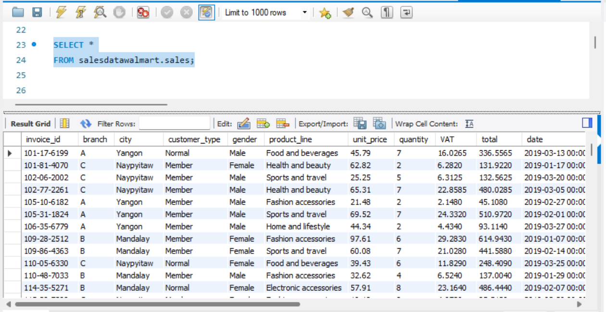

# Walmart-Sales-Performance-Analysis

## Overview
This project aims to delve into Walmart's sales data to uncover insights into top-performing branches, popular products, and customer behavior trends. The goal is to optimize sales strategies by identifying patterns that can enhance performance.

## Dataset Source
The dataset originates from the Kaggle Walmart Sales Forecasting Competition. It includes historical sales data from 45 Walmart stores across different regions. Each store encompasses multiple departments, and participants are tasked with predicting sales for each department within each store. The dataset also incorporates significant holiday markdown events, which are known to impact sales, though predicting their specific effects on departments remains challenging.

## Purposes Of The Project
The major aim of thie project is to gain insight into the sales data of Walmart to understand the different factors that affect sales of the different branches.

## About Data
The dataset was obtained from the Kaggle Walmart Sales Forecasting Competition. This dataset contains sales transactions from a three different branches of Walmart, respectively located in Mandalay, Yangon and Naypyitaw. The data contains 17 columns and 1000 rows:

Invoice_id     -         Invoice of the sales made

Branch         -         Branch at which sales were made

City           -         The location of the branch

Customer_type  -         The type of the customer

Gender         -         Gender of the customer making purchase

Product_line   -         Product line of the product self

Unit_price     -         The price of The price of each product

Quantity       -         The amount of the product sold

VAT            -         The amount of tax on the purchase

Total          -          The total cost of the purchase

Date           -          The date on which the purchase was made

Time           -          The time at which the purchase was maded

Payment_method -          The total amount paid

COGS           -           Cost Of Goods 

Gross_margin_percentage -  Gross margin percentage is a financial metric that shows the percentage of revenue that exceeds the cost of goods sold (COGS). 

Gross_income        -      This is the total revenue a company earns from its sales before deducting any expenses like operating costs, taxes, interest, and other expenses.

Rating            -        Rating refers to the score or assessment given by customers based on their satisfaction with a product or service.

## Analysis List

### Product Analysis

Conduct an analysis to understand different product lines, identify top-performing product lines, and pinpoint those needing improvement.

### Sales Analysis

Analyze sales trends to evaluate the effectiveness of current sales strategies and determine necessary modifications to increase sales.

### Customer Analysis

Identify different customer segments, uncover purchase trends, and assess the profitability of each segment.

## Approach Used

### Data Wrangling

The first step involves inspecting the data to detect and address NULL and missing values through data replacement methods.

(a) Build a database.

(b) Create tables and insert the data.

(c) Select columns with NULL values.

There are no NULL values in our database, as we set NOT NULL constraints for each field when creating the tables, thus filtering out NULL values.

### Feature Engineering

Generate new columns from existing ones to derive additional insights.

(a) Add a new column named time_of_day to categorize sales into Morning, Afternoon, and Evening, helping to identify when most sales occur.

(b) Add a new column named day_name to extract the days of the week (Mon, Tue, Wed, Thu, Fri) to determine which days are the busiest for each branch.

(c) Add a new column named month_name to extract the months of the year (Jan, Feb, Mar) to identify which months yield the highest sales and profit.

### Exploratory Data Analysis (EDA)

Perform EDA to answer the project’s key questions and objectives.

## Conclusion 

## Business Questions to Answer

### Generic Questions

(a) How many unique cities are represented in the dataset?

(b) Which city is each branch located in?

(c) What is the total sales generated?

(d) How many items were sold in total?

### Product Questions

(a) How many unique product lines are present in the dataset?

(b) What is the average customer rating for each product line?

(c) What is the most commonly used payment method?

(d) What is the most selling product line?

(e) Which product line generated the highest sales?

(f) What is the total revenue by month?

(g) What month had the largest COGS?

(h) Which product line had the largest revenue?

(i) What is the city with the largest revenue?

(j) What product line had the largest VAT?

(k) Which branch sold more products than average product sold?

(l) What is the most common product line by gender?

(m) What is the average rating of each product line?

### Sales Questions

(a) What are the total sales for each branch?

(b) How much revenue was generated by each payment method?

(c) What is the gross margin percentage by branch?

(d) List all transactions where the total sales amount is above $500.

(e) Number of sales made in each time of the day per weekday

(f) How much tax has been collected in each city?

(g) Which of the customer types brings the most revenue?

(h) What is the total gross income generated in each city?

(i) Which city has the largest tax percent/ VAT (Value Added Tax)?

(j) Which customer type pays the most in VAT?

(k) How do sales vary by time of day (Morning, Afternoon, Evening)?

### Customer Questions

(a) How many unique customer types does the data have?

(b) How many unique payment methods does the data have?

(c)  Which customer type buys the most?

(d) What is the gender of most of the customers?

(e) What is the gender distribution per branch?

(f) Which time of the day do customers give most ratings?

(g) Which time of the day do customers give most ratings per branch?

(h) Which branch has the highest total sales?

(i) Which day of the week has the best average ratings?

(j) Which day of the week has the best average ratings per branch?

## Revenue And Profit Calculations

$ COGS = unitsPrice * quantity $

$ VAT = 5% * COGS $

$VAT$ is added to the $COGS$ and this is what is billed to the customer.

$ total (gross_sales) = VAT + COGS $

$ grossProfit(grossincome) = total (gross_sales) - COGS $

Gross Margin is gross profit expressed in percentage of the total (gross profit/revenue)

$ |text{Gross Marain} = |frac{|text{gross income}} {text{total revenue}} $

### Example with the first row in our Database:

### Data given:

  • $ \text{Unite Price} = 45.79 $
  • $ text{Quantity} = 7 $

$ COGS = 45.79 * 7 = 320.53 $

$ \text{VAT} = 5% * COGS\= 5% 320.53 = 16.0265$

$ total = VAT + COGS|= 16.0265 + 320.53 = $336.5565$

$ (text{Gross Margin Percentage} = (fracf|text{gross income}/text{totalrevenue}}|=\frac{16.0265}{336.5565} = 0.047619||approx 4.7619% $

## Code

Please refer to the [Walmart Sales Project SQL file](https://github.com/omoniyidamilola/Walmart-Sales-Performance-Analysis/blob/main/Walmart%20Sales%20Project.sql).

